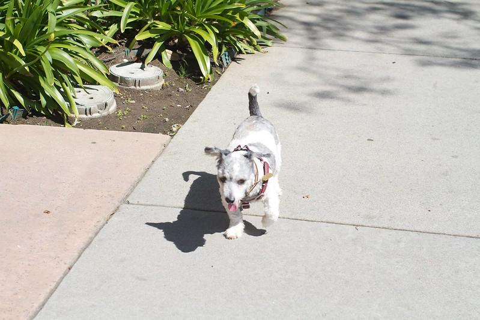
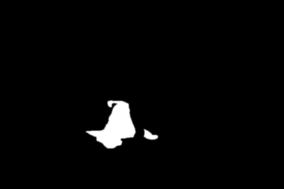
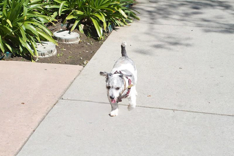
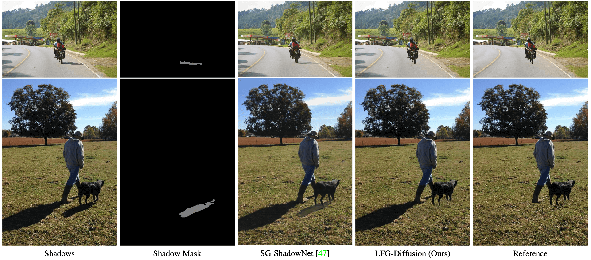

<table>
  <tr>
    <td></td>
    <td></td>
    <td></td> 
  </tr>
  <tr>
  <td>Shadow Image</td>
  <td>Instance Mask</td>
  <td><b>Instance Removel (Ours)</b></td>
  </tr>
</table>

# Instance Shadow Diffusion
This repository contains the official implementation of the following paper:
> Latent Feature-Guided Diffusion Models for Shadow Removal <br>
> Kangfu Mei <sup>1, 2</sup>, Luis Figueroa <sup>2</sup>, Zhe Lin <sup>2</sup>, Zhihong Ding <sup>2</sup>, Scott Cohen <sup>2</sup>, Vishal M. Patel <sup>1</sup>  <br>
> <sup>1</sup>Johns Hopkins University <br>
> <sup>2</sup>Adobe Research <br>

[\[Paper\]](https://kfmei.page/shadow-diffusion/instance_shadow.pdf) [\[Code\]](https://github.com/MKFMIKU/Instance-Shadow-Diffusion) [\[Pretrained Model\]](#pretrain-models) [\[Visual Results\]]() [\[Demo Video 🔥\]](https://www.youtube.com/watch?v=WvWBoOZR208)  [\[Live Demo 🔥\]](https://huggingface.co/spaces/MKFMIKU/Instance-Shadow-Removal)



## Introduction of Our Work
We propose the first instance-level shadow removal algorithm that can generating clear images or clear regions on shadow images (i.e. instance-level).
It can preserve high-fidelity in generated results with the original shadow images.


The table below are performance comparison with our method and the previous non-diffusion based methods. We compare them with RMSE metric in *shadow region / non-shadow region / all image*, respectively. More results can be found [here](#result).

| model          | AISTD &darr; | ISTD &darr; | SRD (shadow region)  &darr; |
|----------------|-------|--------|--------|
| [BMNet](https://github.com/KevinJ-Huang/BMNet) | 5.69 / 2.52 / 3.02 | 7.44 / 4.61 / 5.06 | 7.40 |
| Ours | **5.15** / **2.47** / **2.90** | **6.41** / 4.65 / **4.93**  | **6.81** |


## Method Overview
<!-- <p align="center">  </p> -->


---

> <b>Abstract</b>: Recovering textures under shadows has remained a challenging problem due to the difficulty of inferring shadow-free scenes from shadow images. In this paper, we propose the use of diffusion models as they offer a promising approach to gradually refine the details of shadow regions during the diffusion process. Our method improves this process by conditioning on a learned latent feature space that inherits the characteristics of shadow-free images, thus avoiding the limitation of conventional methods that condition on degraded images only. Additionally, we propose to alleviate potential local optima during training by fusing noise features with the diffusion network. We demonstrate the effectiveness of our approach which outperforms the previous best method by 13\% in terms of RMSE on the AISTD dataset. Further, we explore instance-level shadow removal, where our model outperforms the previous best method by 82\% in terms of RMSE on the DESOBA dataset.

## Detail Contents
1. [Setup & Dataset](#setup--dataset)
2. [Training](#training)
3. [Testing](#testing)
5. [Results](#results)
6. [Pretrain Models](#pretrain-models)
7. [Citations](#citations)
8. [License](#license)
9. [Acknowledgement](#acknowledgement)

## Setup & Dataset

To set up a Python virtual environment with the required dependencies, run:
```bash
# create virtual environment
python3 -m venv ./envs
source ./envs/bin/activate
# update pip, setuptools and wheel
pip3 install --upgrade pip setuptools wheel
# install all required packages
pip3 install -r requirements.txt
```

Install the guided-diffusion dependence, run:
```bash
git clone https://github.com/jychoi118/P2-weighting.git /tmp/p2w
pip install -e /tmp/p2w
```

*Setup huggingface accelerate for distributed training
```bash
accelerate config
```

To export the install requirements, run:
```bash
pip3 freeze > requirements.txt
```

Once done with virtual environment, deactivate with command:
```bash
deactivate
```

### Dataset
We use the AISTD dataset for trainning the model. Random-crop augmentation is applied into the AISTD dataset and results in 26,120 patches for training.
<table>
  <tr>
    <th>Dataset</th>
    <th>Training Set </th> 
    <th>Testing Set</th>
  </tr>
  <tr>
    <td>AISTD (full shadow)</td>
    <td> (augmented patch) 26120 shadow / mask / shadow_free pairs
    <br> 
    <a href="https://www.cis.jhu.edu/~kmei1/publics/shadow/datasets/aistd_train.zip">[Download]</a> 
    </td>
    </td>
    <td> 540 shadow / mask / shadow_free pairs
    <br> 
    <a href="https://www.cis.jhu.edu/~kmei1/publics/shadow/datasets/istd_test.zip">[Download]</a> 
    </td>
  </tr>
  <tr>
    <td>ISTD (full shadow)</td>
    <td> (augmented patch) 26120 shadow / mask / shadow_free pairs
    <br> 
    <a href="https://www.cis.jhu.edu/~kmei1/publics/shadow/datasets/istd_train.zip">[Download]</a> 
    </td>
    </td>
    <td> 540 shadow / mask / shadow_free pairs
    <br> 
    <a href="https://www.cis.jhu.edu/~kmei1/publics/shadow/datasets/aistd_test.zip">[Download]</a> 
    </td>
  </tr>
  <!-- <tr>
    <td>SRD (full shadow)</td>
    <td>-</td>
    <td> 408 shadow / mask / shadow_free pairs
    <br>
    <a href="https://www.cis.jhu.edu/~kmei1/publics/shadow/datasets/srd_test.zip">[Download]</a>
    </td>
  </tr> -->
  <tr>
    <td>DeSOBA (instance shadow)</td>
    <td>-</td>
    <td>160 shadow / 624 shadow masks
    <br>
    <a href="https://www.cis.jhu.edu/~kmei1/publics/shadow/datasets/desoba_test.zip">
    [Download]
    </a>
    </td>
  </tr>
</table>

## Training
1. Please download the training dataset and testing dataset (on-the-fly testing with 10 steps DDIM solver) corresponding to the task and then place them in the folder specified as follows
```bash
# downloading training data 
cd data && wget https://www.cis.jhu.edu/~kmei1/publics/shadow/datasets/aistd_train.zip
unzip aistd_train.zip && rm aistd_train.zip
cd ..

# downloading testing data
cd data && wget https://www.cis.jhu.edu/~kmei1/publics/shadow/datasets/aistd_test.zip
unzip aistd_test.zip && rm aistd_test.zip
cd ..
```

You are expected to see the following file structres otherwise you need to manually rename those directory into the correct one.
```bash
$ tree ./data --filelimit 3

./data
├── aistd_test
│   ├── mask  [540 entries exceeds filelimit, not opening dir]
│   ├── shadow  [540 entries exceeds filelimit, not opening dir]
│   └── shadow_free  [540 entries exceeds filelimit, not opening dir]
└── aistd_train
    ├── mask  [26120 entries exceeds filelimit, not opening dir]
    ├── shadow  [26120 entries exceeds filelimit, not opening dir]
    └── shadow_free  [26120 entries exceeds filelimit, not opening dir]

9 directories, 0 files
```

2. Follow the instructions below to train our model on full-shadow removal. 

```bash
NCCL_P2P_DISABLE=1 CUDA_VISIBLE_DEVICES=2,3,4,5,6,7,8,9 accelerate launch --multi_gpu shadow_aistd_train.py
```

## Testing
It will generate the shadow-free images in the `experiments` directory and then calculate the PSNR values at the same time. You will need to manually modify the checkpoint path in `accelerator.load_state('experiments/state_059999.bin')`.
```bash
# Deshadow
NCCL_P2P_DISABLE=1 CUDA_VISIBLE_DEVICES=0,1,2,3,4,5,6,7 accelerate launch --multi_gpu shadow_aistd_test.py
```

For more detailed metrics calculation such as evaluating RMSE and SSIM in shadow region, non-shadow region, and all-images, please use `evaluation_scripts/aistd_mae_evaluation.ipynb` after generating deshadowed image.

## Results
- Our full-shadow removal results: <b> [AISTD](https://www.cis.jhu.edu/~kmei1/publics/shadow/results/aistd_ours.zip) | [ISTD](https://www.cis.jhu.edu/~kmei1/publics/shadow/results/istd_ours.zip) | [SRD](https://www.cis.jhu.edu/~kmei1/publics/shadow/results/srd_ours.zip) </b>

- Our instance-level shadow removal results: <b>[DeSOBA](https://www.cis.jhu.edu/~kmei1/publics/shadow/results/desoba_ours.zip)</b>


## Pretrain Models
You can find our pretrained models in [here](https://www.cis.jhu.edu/~kmei1/publics/shadow/pretrained_models/).

## Citations
You may want to cite:
```
@article{mei2024shadow,
  title={Latent Feature-Guided Diffusion Models for Shadow Removal},
  author={Mei, Kangfu and Figueroa, Luis and Lin, Zhe and Ding, Zhihong and Cohen, Scott and Patel, Vishal},
  year={2024}
}
```
## License
This code is licensed under the [Creative Commons Attribution-NonCommercial 4.0 International](https://creativecommons.org/licenses/by-nc/4.0/) for non-commercial use only.
Please note that any commercial use of this code requires formal permission prior to use.

## Acknowledgement
This detailed READEME is inspired by [SRFormer](https://github.com/HVision-NKU/SRFormer/blob/main/README.md).
